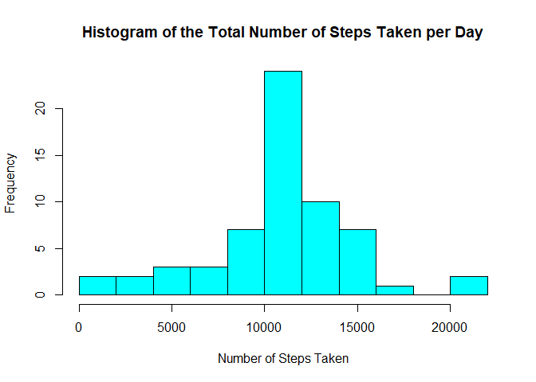

## Loading and preprocessing the data

```r
unzip("activity.zip")
df <- read.csv("activity.csv", colClasses=c("numeric", "Date", "numeric"))
head(df)
```

```
##   steps       date interval
## 1    NA 2012-10-01        0
## 2    NA 2012-10-01        5
## 3    NA 2012-10-01       10
## 4    NA 2012-10-01       15
## 5    NA 2012-10-01       20
## 6    NA 2012-10-01       25
```

```r
str(df)
```

```
## 'data.frame':	17568 obs. of  3 variables:
##  $ steps   : num  NA NA NA NA NA NA NA NA NA NA ...
##  $ date    : Date, format: "2012-10-01" "2012-10-01" ...
##  $ interval: num  0 5 10 15 20 25 30 35 40 45 ...
```


## What is mean total number of steps taken per day?
first ignore all Na


```r
igdf <- df[!is.na(df[['steps']]), ]
head(igdf)
```

```
##     steps       date interval
## 289     0 2012-10-02        0
## 290     0 2012-10-02        5
## 291     0 2012-10-02       10
## 292     0 2012-10-02       15
## 293     0 2012-10-02       20
## 294     0 2012-10-02       25
```

```r
str(igdf)
```

```
## 'data.frame':	15264 obs. of  3 variables:
##  $ steps   : num  0 0 0 0 0 0 0 0 0 0 ...
##  $ date    : Date, format: "2012-10-02" "2012-10-02" ...
##  $ interval: num  0 5 10 15 20 25 30 35 40 45 ...
```

To calculate the total number of steps taken per day, the data first needs to be grouped separately for each day, and then the sum of each group calculated. The aggregate function can complete both of these steps, and format the output in a tidy data frame.


```r
totalStepsDay <- aggregate(steps ~ date, igdf, sum)
head(totalStepsDay)
```

```
##         date steps
## 1 2012-10-02   126
## 2 2012-10-03 11352
## 3 2012-10-04 12116
## 4 2012-10-05 13294
## 5 2012-10-06 15420
## 6 2012-10-07 11015
```


```r
hist(totalStepsDay$steps, breaks=10, xlab="Number of Steps Taken", 
     main="Histogram of the Total Number of Steps Taken per Day",
     col='cyan')
```

<!-- -->


```r
library(dplyr)
totalStepsSummary <- summarise(totalStepsDay, meanOfTotalSteps=mean(totalStepsDay$steps),
                      medianOfTotalSteps=median(totalStepsDay$steps))
print(totalStepsSummary)
```

```
##   meanOfTotalSteps medianOfTotalSteps
## 1         10766.19              10765
```


## What is the average daily activity pattern?

```r
meanStepsInterval <- aggregate(steps ~ interval, igdf, mean)
head(meanStepsInterval)
```

```
##   interval     steps
## 1        0 1.7169811
## 2        5 0.3396226
## 3       10 0.1320755
## 4       15 0.1509434
## 5       20 0.0754717
## 6       25 2.0943396
```

```r
plot(meanStepsInterval$interval, meanStepsInterval$step, type='l', 
     xlab="interval", ylab="average of steps", 
     main='average daily activity pattern',
     col='purple')
```

<!-- -->

Which 5-minute interval, on average across all the days in the dataset, contains the maximum number of steps?


```r
meanStepsInterval$interval[which.max(meanStepsInterval$step)]
```

```
## [1] 835
```

```r
max(meanStepsInterval$step)
```

```
## [1] 206.1698
```


## Imputing missing values
report the total number of missing values in the dataset


```r
data.frame(steps=sum(is.na(df$steps)), 
           interval=sum(is.na(df$interval)), 
           date=sum(is.na(df$date)))
```

```
##   steps interval date
## 1  2304        0    0
```

all Na in steps column.
fill Na with average of all samples.


```r
fidf <- df

fidf[is.na(fidf[['steps']]), 1] <- mean(df$steps, na.rm = TRUE)
head(fidf)
```

```
##     steps       date interval
## 1 37.3826 2012-10-01        0
## 2 37.3826 2012-10-01        5
## 3 37.3826 2012-10-01       10
## 4 37.3826 2012-10-01       15
## 5 37.3826 2012-10-01       20
## 6 37.3826 2012-10-01       25
```


```r
totalStepsDay <- aggregate(steps ~ date, fidf, sum)
head(totalStepsDay)
```

```
##         date    steps
## 1 2012-10-01 10766.19
## 2 2012-10-02   126.00
## 3 2012-10-03 11352.00
## 4 2012-10-04 12116.00
## 5 2012-10-05 13294.00
## 6 2012-10-06 15420.00
```


```r
hist(totalStepsDay$steps, breaks=10, xlab="Number of Steps Taken", 
     main="Histogram of the Total Number of Steps Taken per Day",
     col='cyan')
```

<!-- -->


```r
library(dplyr)
totalStepsSummary <- summarise(totalStepsDay, meanOfTotalSteps=mean(totalStepsDay$steps),
                      medianOfTotalSteps=median(totalStepsDay$steps))
print(totalStepsSummary)
```

```
##   meanOfTotalSteps medianOfTotalSteps
## 1         10766.19           10766.19
```

median is changed.


## Are there differences in activity patterns between weekdays and weekends?


```r
fidf$isWeekend <- weekdays(fidf$date) %in% c("Saturday", "Sunday")
head(fidf)
```

```
##     steps       date interval isWeekend
## 1 37.3826 2012-10-01        0     FALSE
## 2 37.3826 2012-10-01        5     FALSE
## 3 37.3826 2012-10-01       10     FALSE
## 4 37.3826 2012-10-01       15     FALSE
## 5 37.3826 2012-10-01       20     FALSE
## 6 37.3826 2012-10-01       25     FALSE
```


```r
fidf$isWeekend <- weekdays(fidf$date) %in% c("Saturday", "Sunday")
head(fidf)
```

```
##     steps       date interval isWeekend
## 1 37.3826 2012-10-01        0     FALSE
## 2 37.3826 2012-10-01        5     FALSE
## 3 37.3826 2012-10-01       10     FALSE
## 4 37.3826 2012-10-01       15     FALSE
## 5 37.3826 2012-10-01       20     FALSE
## 6 37.3826 2012-10-01       25     FALSE
```


```r
weekdayData <- fidf[!fidf$isWeekend, ]
weekendData <- fidf[fidf$isWeekend, ]
```


```r
weekdayMean <- aggregate(steps ~ interval, weekdayData, mean)
weekendMean <- aggregate(steps ~ interval, weekendData, mean)
```


```r
par(mfrow=c(2, 1), mar=c(4, 4.1, 3, 2.1))
plot(weekdayMean$interval, weekdayMean$steps, type="l",
     main="Time Series Plot of Average Steps Taken per Interval, for Weekdays",
     xlab="Intervals (in 5 mins)", ylab="Number of Steps",
     col="darkred", lwd=1.5, ylim=c(0, 230))
plot(weekendMean$interval, weekendMean$steps, type="l",
     main="Time Series Plot of Average Steps Taken per Interval, for Weekends",
     xlab="Intervals (in 5 mins)", ylab="Number of Steps",
     col="darkblue", lwd=1.5, ylim=c(0, 230))
```

<!-- -->


